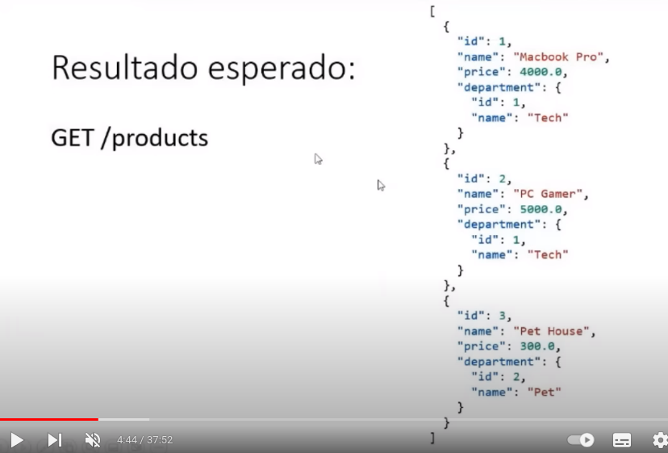
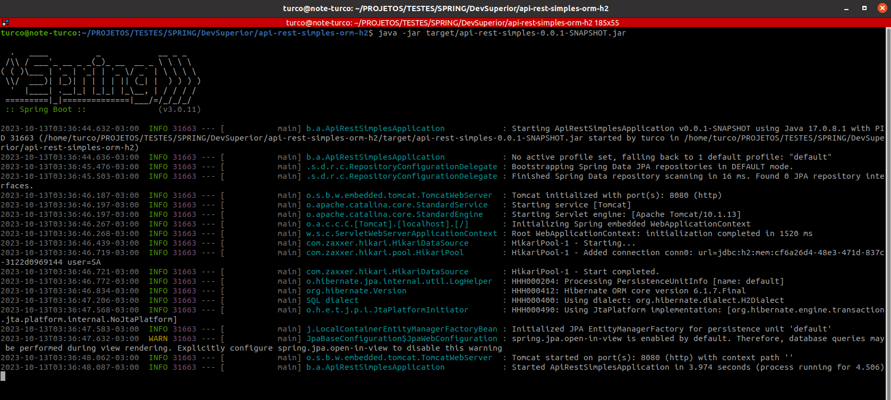
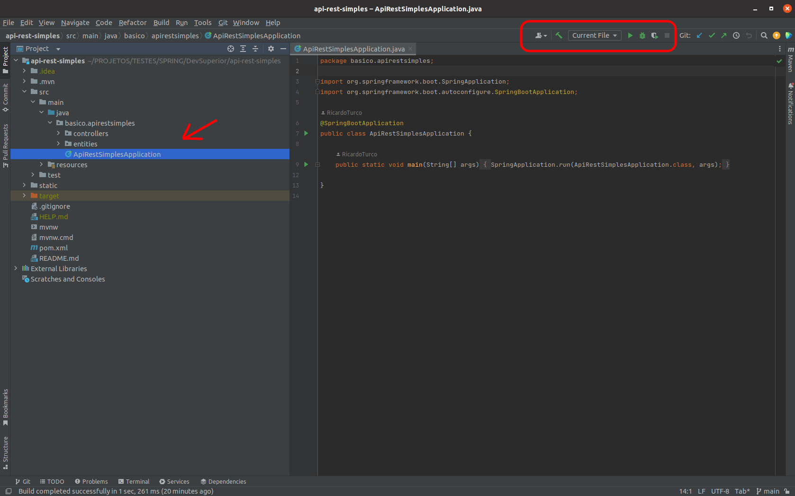
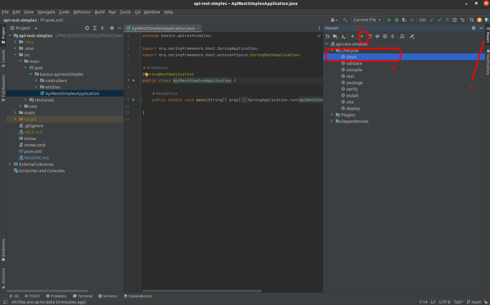
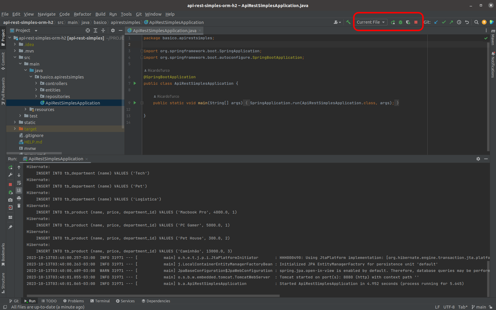
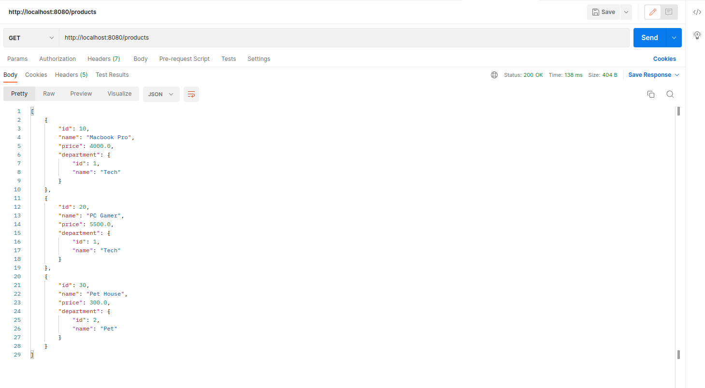
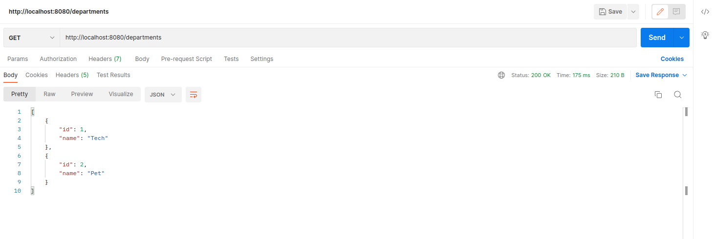
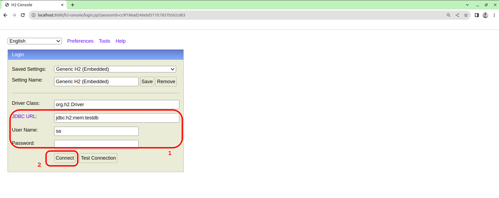
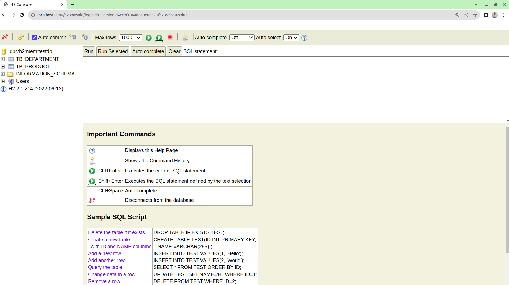
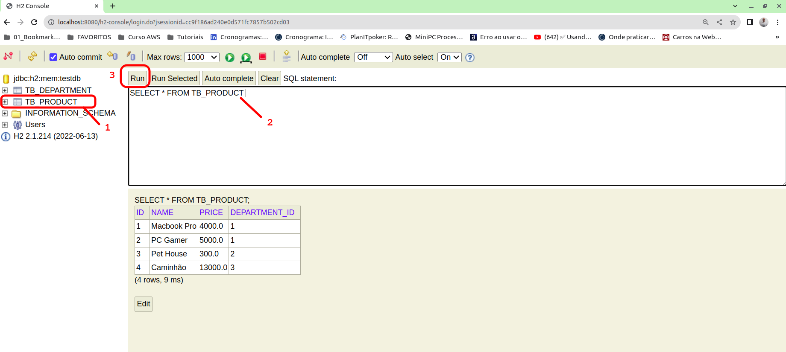

# api-rest-simples-orm-h2

Exemplo de uma API Rest simples utilizando Java e Spring.

## IMPORTANTE:

```
Nesta API é implementada a utilização de um banco de dados H2, onde as informações (registros),
serão inseridos préviamente para posterior visualização via requisição da API.

Lembrando que o código dessa API é uma CONTINUAÇÃO de um outro projeto:
(https://github.com/RicardoTurco/api-rest-simples)
```

## Entidades:


## Endpoints:

`GET /departments`

`GET /products`




## Executando o projeto:
```
Podemos executar o projeto localmente, de 2 formas:

VIA TERMINAL:

- clonar o projeto
- entrar no diretório / pasta do projeto

Executar os seguintes comandos:

- mvn clean
- mvn install
- java -jar target/api-rest-simples-0.0.1-SNAPSHOT.jar
```



```
b) VIA IDE:
(no exemplo, está sendo utilizado o IntelliJ da Jetbrains)

- clonar o projeto
- abrir o projeto dentro da IDE (IntelliJ)
- navegar até o "entrypoint" do projeto (vide imagem)
```



```
- executar o "clean" no Maven (vide imagem)
```



```
- executar o "install" no Maven (vide imagem)
```


```
- executar o projeto (vide imagem)
```



```
Com a aplicação em execução, basta realizar uma requisição em qualquer
um dos endpoints do projeto:
```





## Banco de dados:
```
O projeto está configurado para acessar um banco de dados H2. 

Toda vez que o projeto é iniciado / executado, o banco de dados é criado do "zero" 
e ALGUNS registros são inseridos na base. 

IMPORTANTE:

Esses registros estão no arquivo "src/main/resources/import.sql". O nome desse arquivo
NÃO deve ser alterado, senão o H2 não vai realizar a insersão dos registros !!! 
```

```
Com a aplicação em execução, basta acessar no browser:  "http://localhost:8080/h2-console"
e teremos acesso à um "console" para visualização / administração dos registros.

As configurações de acesso estão no arquivo "src/main/resources/application.properties"
```





```
No console, temos acesso às tabelas / registros criados, para visualizar basta clicar
sobre a tabela desejada (item 1) que será criado a instrução para exibir TODOS os 
registros "automaticamente (item 2), e em seguida basta clicar no botão RUN (item 3):
```



## Credits:
```
O projeto é baseado em um vídeo explicativo do canal DevSuperior no Youtube.
```
